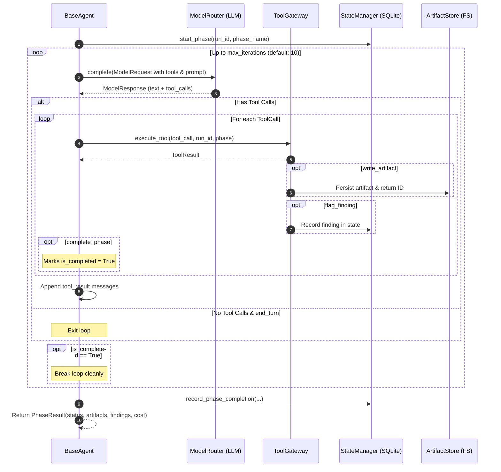

# AIDLC Agent Reference Guide

This document provides a comprehensive, in-depth explanation of all **12 lifecycle agents** and the underlying **`BaseAgent`** execution engine in AIDLC.

---

## 1. Architectural Foundation: `BaseAgent`

All phase agents inherit from [`BaseAgent`](file:///home/chaitanya/Documents/project_euler/src/aidlc/agents/base.py), which implements the core autonomous agent loop. Subclasses do not need to implement their own while-loops; they declare:
1. **`name`**: Phase identifier (e.g. `intake`, `build`, `verify`).
2. **`tier`**: Model tier requested (`tier1` = low effort, `tier2` = standard, `tier3` = deep reasoning).
3. **`can_run(state)`**: Precondition check verifying necessary prior artifacts exist.
4. **`get_system_prompt()`**: Persona, domain judgment criteria, instructions, and rules.
5. **`get_initial_prompt(context)`**: Context hydration (retrieving prior phase artifacts from SQLite state and filesystem).

### The Autonomous Execution Loop (`BaseAgent.run`)



1. **Pre-flight**: Checks `can_run()`. Invokes `state_manager.start_phase()`, setting phase status to `running` and incrementing the attempt counter.
2. **Tool Discovery**: Queries `tool_gateway.get_tool_definitions(phase_name)` to supply only authorized tools to the model.
3. **Reasoning Loop**: Iterates up to `max_iterations = 10`. Dispatches prompt history, system prompt, and tools to the active LLM provider via `ModelRouter`.
4. **Tool Execution**: Iterates over requested tool calls, validates least-privilege permissions, dispatches execution to `ToolGateway`, and feeds structured `tool_result` messages back into conversation context.
5. **Phase Conclusion**: Intercepts `complete_phase` (or blocker findings), computes token/cost metrics, updates `.aidlc/state.db`, and returns `PhaseResult`.

---

## 2. Detailed Breakdown of All 12 Agents

```text
intake ──▶ scaffold ──▶ spec ──▶ analyze-risks ──▶ create-test-plan ──▶ test-design ──▶ build ──▶ adversarial-review ──▶ verify ──▶ align ──▶ release ──▶ retro
```

---

### 2.1 Intake Agent (`intake`)
- **Class**: [`IntakeAgent`](file:///home/chaitanya/Documents/project_euler/src/aidlc/agents/intake.py)
- **Goal**: Ingest stakeholder vision, problem statements, and architectural preferences, transforming raw intent into a structured specification foundation.
- **Inputs**:
  - Auto-detected `./interview.md` in workspace root.
  - Or raw `--ask "<problem statement>"` CLI parameter.
- **Skills Exercised**:
  - *Architectural Alignment & Interview Parsing*: Inspects `[x]` / `[ ]` checkboxes in `interview.md` to extract development methodology (TDD, BDD, CDD, EDD, DDD), form factor (CLI, REST API, Library), persistence model, and dependency philosophy.
  - *Requirement Extraction*: Identifies actors, problem statements, and target outcomes.
  - *Constraint Identification*: Outlines runtime versions, performance requirements, and platform limits.
- **Authorized Tools**:
  - `write_artifact`: Stores `intake` and `interview` markdown documents and JSON companion metadata.
  - `read_artifact`: Inspects prior intake iterations if retrying.
  - `ask_user`: Formulates clarifying questions if critical ambiguities exist.
  - `complete_phase`: Signals intake completion.
- **Output Artifacts**:
  - `.aidlc/artifacts/<run_id>/intake/intake.v*.md` & `.json`
  - `.aidlc/artifacts/<run_id>/intake/interview.v*.md` & `.json`
- **Human Gate**: Interactively renders an alignment summary in the terminal and prompts `Is everything good...? [Y/n]` before advancing.

---

### 2.2 Scaffold Agent (`scaffold`)
- **Class**: [`ScaffoldAgent`](file:///home/chaitanya/Documents/project_euler/src/aidlc/agents/scaffold.py)
- **Goal**: Bootstrap the physical repository skeleton and engineering foundation based on intake specifications.
- **Inputs**:
  - `intake.md` / `intake.json`
  - `interview.md` / `interview.json`
- **Skills Exercised**:
  - *Stack Selection*: Selects programming language version, packaging format (`pyproject.toml`, `package.json`), and test harness (`pytest`).
  - *Repository Structure Generation*: Sets up standard directory trees (`src/`, `tests/`, `docs/`, `infra/`).
  - *Tooling & CI Configuration*: Prepares starter configurations, formatters, and dependency manifests.
- **Authorized Tools**:
  - `fs_write_file`: Bootstraps directory structures and configuration files.
  - `fs_read_file` / `fs_list_files`: Inspects existing workspace assets.
  - `write_artifact`: Stores scaffold report and stack manifest.
  - `complete_phase`: Signals scaffold completion.
- **Output Artifacts**:
  - `.aidlc/artifacts/<run_id>/scaffold/scaffold.v*.md`
  - `.aidlc/artifacts/<run_id>/scaffold/stack-manifest.json`

---

### 2.3 Spec Agent (`spec`)
- **Class**: [`SpecAgent`](file:///home/chaitanya/Documents/project_euler/src/aidlc/agents/spec.py)
- **Goal**: Formulate the authoritative engineering specification, decomposing high-level requirements into verifiable user stories and Gherkin acceptance criteria.
- **Forking Sourcing Modes**:
  - **Mode A (`agent_generated`)**: Autonomous story generation derived from `intake.md`.
  - **Mode B (`human_supplied`)**: Ingests user-provided user stories (`--stories`), checking for scope contradictions against intake boundaries.
- **Skills Exercised**:
  - *Story Decomposition & Slicing*: Breaks features into independent user stories (`STORY-001`, `STORY-002`).
  - *Acceptance Criteria Generation*: Writes testable Gherkin scenarios (`Given ... When ... Then ...`).
  - *Contradiction Detection*: Flags a blocker finding if human stories contradict intake architectural constraints (e.g. asking for a cloud REST API when intake locked stateless CLI).
- **Authorized Tools**:
  - `write_artifact`: Stores `spec.v*.md` and `spec.v*.json`.
  - `read_artifact`: Ingests `intake.md` and `scaffold.md`.
  - `flag_finding`: Reports contradiction blockers (`BLOCKER-001`).
  - `complete_phase`: Signals spec readiness (`passed` or `blocked`).
- **Output Artifacts**:
  - `.aidlc/artifacts/<run_id>/spec/spec.v*.md` & `.json`

---

### 2.4 Analyze-Risks Agent (`analyze-risks`)
- **Class**: [`AnalyzeRisksAgent`](file:///home/chaitanya/Documents/project_euler/src/aidlc/agents/analyze_risks.py)
- **Goal**: Multi-lens red-team attack on the specification *before* code is written, uncovering hidden traps, security vulnerabilities, and logic gaps.
- **Inputs**:
  - `spec.md` & `spec.json`
  - `intake.md` & `interview.md`
- **Internal Review Lenses (Skills)**:
  - *Ambiguity Detection*: Detects undefined terminology, conflicting rules, and missing error specifications.
  - *Edge-Case Analysis*: Stresses boundary conditions (empty inputs, nulls, duplicates, numeric overflows, timeouts, concurrency).
  - *Scope-Creep Detection*: Flags accidental feature additions that were never requested in intake.
  - *Security Preflight*: Evaluates input validation surfaces, authentication boundaries, path traversal, and injection surfaces.
- **Authorized Tools**:
  - `read_artifact`: Retrieves specs and intake contracts.
  - `write_artifact`: Stores risk assessment report and structured risk register.
  - `flag_finding`: Issues formal findings tagged by severity (`blocker`, `critical`, `warning`, `info`).
  - `complete_phase`: Signals pass or blocked status.
- **Output Artifacts**:
  - `.aidlc/artifacts/<run_id>/analyze-risks/risk-report.v*.md` & `.json`
- **Routing**: Blocker findings route backward to `spec` (or halt for human intervention). Non-blocking findings advance to `create-test-plan`.

---

### 2.5 Create-Test-Plan Agent (`create-test-plan`)
- **Class**: [`TestPlanAgent`](file:///home/chaitanya/Documents/project_euler/src/aidlc/agents/test_plan.py)
- **Goal**: Formulate the comprehensive verification strategy and map every acceptance criterion to concrete test mechanisms.
- **Inputs**:
  - `spec.md` (Acceptance criteria)
  - `risk-report.md` (Identified edge cases and security risks)
- **Skills Exercised**:
  - *AC-to-Test Mapping*: Correlates each AC to verification tiers (unit, integration, regression, boundary, security).
  - *Coverage-Gap Analysis*: Guarantees that high-risk areas receive multiple verification mechanisms and no AC is left unverified.
- **Authorized Tools**:
  - `read_artifact`: Reads specification and risk reports.
  - `write_artifact`: Stores test plan and coverage matrix.
  - `flag_finding`: Flags unverifiable requirements.
  - `complete_phase`: Signals test plan readiness.
- **Output Artifacts**:
  - `.aidlc/artifacts/<run_id>/create-test-plan/test-plan.v*.md`
  - `.aidlc/artifacts/<run_id>/create-test-plan/coverage-matrix.json`

---

### 2.6 Test-Design Agent (`test-design` / `create-tests`)
- **Class**: [`TestDesignAgent`](file:///home/chaitanya/Documents/project_euler/src/aidlc/agents/test_design.py)
- **Goal**: Generate executable automated test suites in code *before* the application implementation is written (Test-Driven Development / Test-First).
- **Inputs**:
  - `spec.md`, `test-plan.md`, `risk-report.md`
- **Skills Exercised**:
  - *Test Case Synthesis*: Writes concrete `pytest` test suites in `tests/test_*.py`.
  - *Fixture & Mock Design*: Sets up deterministic test inputs, edge-case assertions, and mocks.
  - *Failure Expectation*: Prepares tests designed to fail until implementation code is provided by Build.
- **Authorized Tools**:
  - `fs_write_file`: Creates test files (`tests/test_*.py`).
  - `fs_read_file` / `fs_list_files`: Inspects test directories.
  - `write_artifact`: Stores test design documentation.
  - `complete_phase`: Signals test design completion.
- **Output Artifacts**:
  - Physical code: `tests/test_*.py`
  - `.aidlc/artifacts/<run_id>/test-design/test-design.v*.md` & `test-map.json`

---

### 2.7 Build Agent (`build`)
- **Class**: [`BuildAgent`](file:///home/chaitanya/Documents/project_euler/src/aidlc/agents/build.py)
- **Goal**: Implement clean, robust, production-grade source code designed specifically to fulfill the specifications and pass the designed test suites.
- **Inputs**:
  - `spec.md`, `test-design.md`, existing test suites in `tests/`
- **Skills Exercised**:
  - *Repository Reconnaissance*: Inspects existing files and modules.
  - *Implementation Planning*: Determines module architecture and clean separation of concerns.
  - *Code Generation*: Uses `fs_write_file` to author source code (e.g. `src/` or `generated/`).
  - *Local Validation*: Refines code structure to eliminate syntax defects.
- **Authorized Tools**:
  - `fs_write_file`: Writes source modules.
  - `fs_read_file` / `fs_list_files`: Reads specifications and codebase structure.
  - `run_command`: Executes quick local syntax checks.
  - `write_artifact`: Stores build report documenting files created.
  - `complete_phase`: Signals build completion.
- **Output Artifacts**:
  - Physical code: `src/*.py` or `generated/*.py`
  - `.aidlc/artifacts/<run_id>/build/build.v*.md`

---

### 2.8 Adversarial-Review Agent (`adversarial-review` / `red_team_review`)
- **Class**: [`AdversarialReviewAgent`](file:///home/chaitanya/Documents/project_euler/src/aidlc/agents/adversarial_review.py)
- **Goal**: Act as an independent criticism layer (Red Team) evaluating the implementation code diff before formal test verification.
- **Review Lenses (Skills)**:
  - *Correctness Audit*: Verifies logic implementation against acceptance criteria.
  - *Security Review*: Checks for code injection (eval/exec), path traversal, secret leakage, and unsafe input handling.
  - *Reliability & Resource Safety*: Identifies unhandled exceptions, resource leaks, or missing boundary checks.
  - *Spec Compliance*: Ensures the developer agent didn't omit requirements or add unsolicited features.
- **Authorized Tools**:
  - `fs_read_file` / `fs_list_files`: Inspects written code diffs.
  - `read_artifact`: Retrieves specs and build manifests.
  - `write_artifact`: Stores review report.
  - `flag_finding`: Flags defects by severity.
  - `complete_phase`: Emits verdict (`PASS`, `PASS_WITH_WARNINGS`, `FAIL`).
- **Output Artifacts**:
  - `.aidlc/artifacts/<run_id>/adversarial-review/review-report.v*.md` & `.json`
- **Routing**: `FAIL` triggers a bounded backward loop back to `build` with the defect findings attached.

---

### 2.9 Verify Agent (`verify`)
- **Class**: [`VerifyAgent`](file:///home/chaitanya/Documents/project_euler/src/aidlc/agents/verify.py)
- **Goal**: Execute the formal automated test runner, gather empirical execution evidence, and verify traceability to acceptance criteria.
- **Inputs**:
  - Physical code in `src/` and `tests/`
  - Acceptance criteria from `spec.md`
- **Skills Exercised**:
  - *Test Execution*: Invokes test suite via `run_command("pytest -v ...")`.
  - *Result Interpretation*: Parses exit codes, stdout, passed/failed assertions, and execution time.
  - *AC Traceability Mapping*: Correlates passed tests to specific Acceptance Criteria IDs.
- **Authorized Tools**:
  - `run_command`: Executes `pytest -v`.
  - `fs_read_file` / `fs_list_files`: Reads test failure details.
  - `write_artifact`: Stores verification report.
  - `complete_phase`: Emits `passed` or `failed`.
- **Output Artifacts**:
  - `.aidlc/artifacts/<run_id>/verify/verify-report.v*.md`
- **Routing**: Test failures trigger a backward edge back to `build` (with failure logs injected).

---

### 2.10 Align Agent (`align`)
- **Class**: [`AlignAgent`](file:///home/chaitanya/Documents/project_euler/src/aidlc/agents/align.py)
- **Goal**: Perform semantic intent verification: *"Did we build what the stakeholder actually wanted, or did we interpret requirements too literally?"*
- **Inputs**:
  - Original `intake.md` and `interview.md`
  - Final verified implementation and `verify-report.md`
- **Skills Exercised**:
  - *Semantic Diffing*: Compares user problem statements against delivered feature behavior.
  - *Stakeholder Simulation*: Evaluates usability, ergonomics, and practical value from the user's perspective.
  - *Intent Drift Detection*: Uncovers dropped features, usability regressions, or subtle shifts away from user intent.
- **Authorized Tools**:
  - `read_artifact`: Compares intake, spec, and verification artifacts.
  - `fs_read_file`: Inspects user-facing interfaces or CLI commands.
  - `write_artifact`: Stores alignment report and semantic trace.
  - `complete_phase`: Emits `ALIGNED` or `DRIFT`.
- **Output Artifacts**:
  - `.aidlc/artifacts/<run_id>/align/align-report.v*.md` & `semantic-trace.v*.json`
- **Routing**: `DRIFT` triggers a backward loop all the way back to `spec` to realign requirements.

---

### 2.11 Release Agent (`release`)
- **Class**: [`ReleaseAgent`](file:///home/chaitanya/Documents/project_euler/src/aidlc/agents/release.py)
- **Goal**: Package the verified, aligned software into an official, traceable release candidate.
- **Skills Exercised**:
  - *Release Readiness Verification*: Validates that all prior gates (verify, review, align) have passed without open blocker findings.
  - *Semantic Versioning*: Computes appropriate version bump (`0.1.0` $\rightarrow$ `0.1.1`).
  - *Changelog Generation*: Summarizes delivered features, breaking changes, and migration notes.
- **Authorized Tools**:
  - `fs_write_file`: Updates workspace `CHANGELOG.md` or version files.
  - `fs_read_file`: Inspects package metadata.
  - `write_artifact`: Stores release manifest and release notes.
  - `complete_phase`: Signals release readiness.
- **Output Artifacts**:
  - Workspace file: `CHANGELOG.md`
  - `.aidlc/artifacts/<run_id>/release/release-manifest.v*.json`
  - `.aidlc/artifacts/<run_id>/release/release-notes.v*.md`

---

### 2.12 Retro Agent (`retro`)
- **Class**: [`RetroAgent`](file:///home/chaitanya/Documents/project_euler/src/aidlc/agents/retro.py)
- **Goal**: Close the lifecycle loop by analyzing end-to-end execution telemetry, extracting failure patterns, and generating continuous improvement signals.
- **Skills Exercised**:
  - *Phase History & Telemetry Synthesis*: Evaluates phase attempt counts, backward retry loops, token consumption, and execution elapsed time.
  - *Finding Correlation*: Correlates risks detected in `analyze-risks` against defects found in `adversarial-review` and test failures in `verify`.
  - *System Refinement Suggestions*: Proposes constructive improvements for prompt instructions, test strategy rubrics, or interview templates.
- **Authorized Tools**:
  - `read_artifact`: Ingests artifacts across the entire run history.
  - `write_artifact`: Stores retrospective report and structured learning signals.
  - `complete_phase`: Marks run completion.
- **Output Artifacts**:
  - `.aidlc/artifacts/<run_id>/retro/retro.v*.md`
  - `.aidlc/artifacts/<run_id>/retro/learning-signals.v*.json`

---

## 3. Summary Matrix

| Phase | Agent Class | Primary Authorized Tools | Output Artifacts | Backward Loop On Failure |
| :--- | :--- | :--- | :--- | :--- |
| `intake` | `IntakeAgent` | `write_artifact`, `ask_user` | `intake.md`, `interview.md` | Halted at HITL Gate |
| `scaffold`| `ScaffoldAgent` | `fs_write_file`, `write_artifact` | `scaffold.md`, `stack-manifest.json` | None |
| `spec` | `SpecAgent` | `write_artifact`, `flag_finding` | `spec.md`, `spec.json` | None |
| `analyze-risks`| `AnalyzeRisksAgent` | `read_artifact`, `flag_finding`, `write_artifact` | `risk-report.md`, `risk-report.json` | $\longrightarrow$ `spec` (on blocker) |
| `create-test-plan`| `TestPlanAgent` | `read_artifact`, `write_artifact` | `test-plan.md`, `coverage-matrix.json`| None |
| `test-design`| `TestDesignAgent` | `fs_write_file`, `write_artifact` | `tests/test_*.py`, `test-design.md` | None |
| `build` | `BuildAgent` | `fs_write_file`, `run_command`, `write_artifact` | `src/*.py`, `build.md` | None |
| `adversarial-review`| `AdversarialReviewAgent` | `fs_read_file`, `flag_finding`, `write_artifact` | `review-report.md`, `findings.json` | $\longrightarrow$ `build` (on fail) |
| `verify` | `VerifyAgent` | `run_command`, `write_artifact` | `verify-report.md` | $\longrightarrow$ `build` (on test failure) |
| `align` | `AlignAgent` | `read_artifact`, `fs_read_file`, `write_artifact` | `align-report.md`, `semantic-trace.json` | $\longrightarrow$ `spec` (on drift) |
| `release`| `ReleaseAgent` | `fs_write_file`, `write_artifact` | `CHANGELOG.md`, `release-manifest.json` | None |
| `retro` | `RetroAgent` | `read_artifact`, `write_artifact` | `retro.md`, `learning-signals.json` | None (Terminates to `completed`) |
