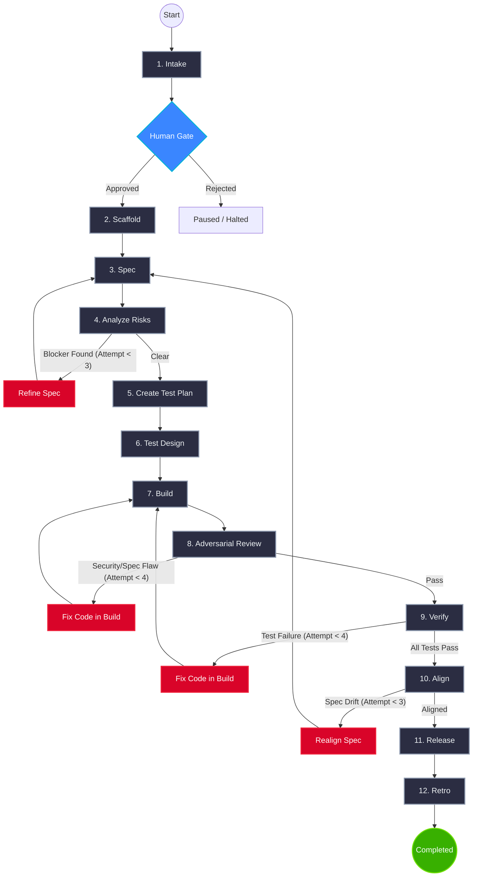
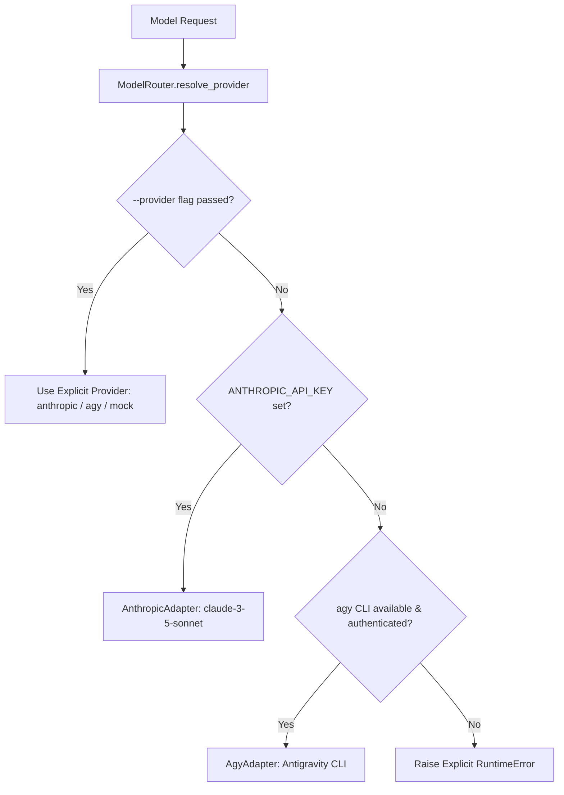
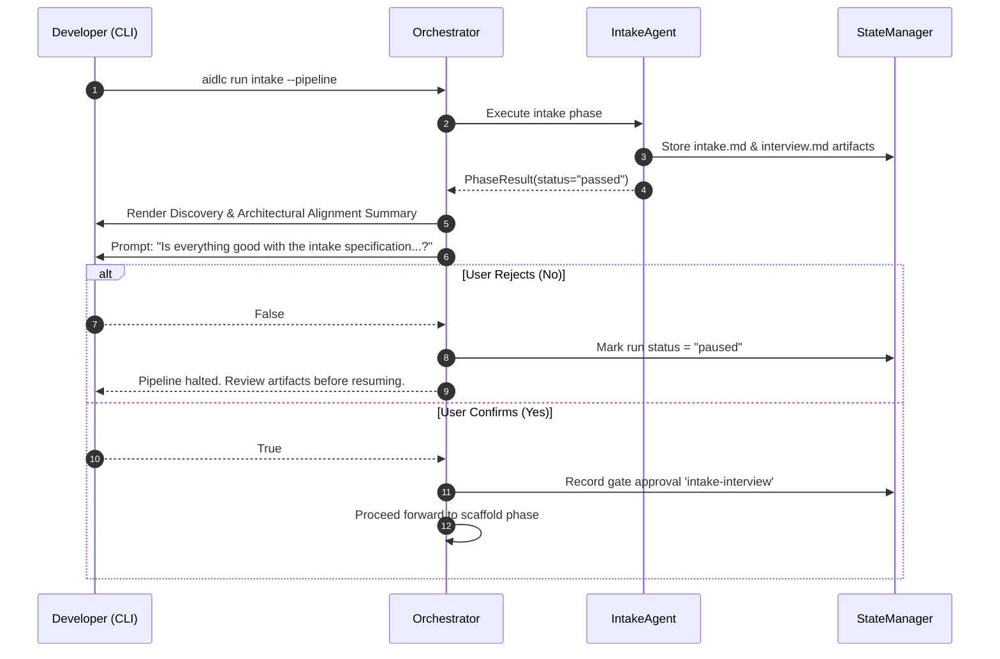

# AIDLC Orchestration Reference Guide

This document provides a comprehensive, deep architectural explanation of how agents, tools, state transitions, backward retry loops, SQLite persistence, cryptographic artifact storage, and LLM providers are orchestrated together in the **AIDLC Core Engine** ([`src/aidlc/orchestrator.py`](file:///home/chaitanya/Documents/project_euler/src/aidlc/orchestrator.py)).

---

## 1. Architectural Philosophy: Native State-Driven Orchestration

AIDLC avoids the complexity, opacity, and heavy dependencies of external graph frameworks (such as LangGraph or AutoGen). Instead, it implements a **clean, deterministic, native Python state machine** backed by a **write-ahead logged (WAL) SQLite database**.

```
                           ┌────────────────────────┐
                           │      CLI / Entry       │
                           │      (aidlc run)       │
                           └───────────┬────────────┘
                                       │
                                       ▼
 ┌────────────────────────────────────────────────────────────────────────┐
 │                      AIDLC Orchestrator Engine                         │
 │                                                                        │
 │   ┌───────────────────────┐            ┌───────────────────────────┐   │
 │   │   Graph Transitions   │            │   Bounded Backward Loops  │   │
 │   │    & Phase Routing    │            │   (Self-Healing Quality)  │   │
 │   └───────────┬───────────┘            └─────────────┬─────────────┘   │
 │               │                                      │                 │
 │               ▼                                      ▼                 │
 │   ┌────────────────────────────────────────────────────────────┐       │
 │   │                   Active Phase Agent (1 of 12)             │       │
 │   └───────────────┬────────────────────────────┬───────────────┘       │
 └───────────────────┼────────────────────────────┼───────────────────────┘
                     │                            │
                     ▼                            ▼
        ┌─────────────────────────┐  ┌─────────────────────────┐
        │       ToolGateway       │  │       ModelRouter       │
        │ (Sandboxed Filesystem,  │  │ (Anthropic, Antigravity │
        │  Commands, Artifacts)   │  │   'agy' CLI, or Mock)   │
        └────────────┬────────────┘  └─────────────────────────┘
                     │
        ┌────────────┴────────────┐
        ▼                         ▼
┌───────────────┐         ┌───────────────┐
│ StateManager  │         │ ArtifactStore │
│ (.aidlc/      │         │ (.aidlc/      │
│  state.db)    │         │  artifacts/)  │
└───────────────┘         └───────────────┘
```

---

## 2. The 12-Phase Pipeline & State Machine

The AIDLC lifecycle consists of 12 sequential phases executing from initial intake through post-release retrospective. The pipeline is directed and strictly ordered, with built-in quality gates and backward edges:



---

## 3. Bounded Backward-Edge Loops (Self-Healing Mechanics)

A major weakness of naïve AI pipelines is cascading failure: an error in specification or code generates broken downstream tests and failed deployments. AIDLC incorporates **bounded backward loops** that return control to an earlier phase with targeted diagnostic context.

### The 4 Active Backward Feedback Loops

| Source Phase | Trigger Condition | Target Phase | Context Injected | Maximum Attempts |
| :--- | :--- | :--- | :--- | :--- |
| **`analyze-risks`** | Returns `status="blocked"` due to irreconcilable contradictions or domain hazards | **`spec`** | Blocker findings, contradiction details, and `retry=True` | `3` (in `spec`) |
| **`adversarial-review`** | Returns `status="failed"` due to security vulnerability, edge-case bug, or requirement deviation | **`build`** | Red team vulnerability findings, proof-of-concept exploits, and `retry=True` | `4` (in `build`) |
| **`verify`** | Returns `status="failed"` due to failing pytest assertions or regression errors | **`build`** | Test failure logs, stack traces, and `retry=True` | `4` (in `build`) |
| **`align`** | Returns `status="failed"` due to divergence between initial user story and final implementation | **`spec`** | Drift findings, unmet acceptance criteria, and `retry=True` | `3` (in `spec`) |

### Guarding Against Infinite Loops: The Retry Budget

To prevent unbounded cycles that consume excessive tokens or time, [`Orchestrator`](file:///home/chaitanya/Documents/project_euler/src/aidlc/orchestrator.py#L131) defines hard retry limits for every phase:

```python
self.retry_limits = {
    "intake": 2,
    "scaffold": 2,
    "spec": 3,
    "analyze-risks": 2,
    "create-test-plan": 2,
    "test-design": 3,
    "build": 4,
    "adversarial-review": 3,
    "verify": 3,
    "align": 2,
    "release": 2,
    "retro": 2,
}
```

Before invoking any phase, the orchestrator inspects the phase attempt counter in `phase_history`. If `attempts >= limit`, the orchestrator marks the run as `failed` and immediately halts execution with an explicit `RuntimeError`, preventing token exhaustion.

---

## 4. State Management Engine (`StateManager`)

All execution state is persisted in an embedded SQLite database at `.aidlc/state.db`. AIDLC activates **Write-Ahead Logging (`PRAGMA journal_mode = WAL`)** upon connection to ensure lock-free concurrent reads and reliable writes.

### Database Schema Architecture

```
                    ┌────────────────────────┐
                    │          meta          │
                    ├────────────────────────┤
                    │ key: TEXT (PK)         │
                    │ value: TEXT            │
                    └────────────────────────┘
                                │
                    ┌───────────┴────────────┐
                    │          runs          │
                    ├────────────────────────┤
                    │ run_id: TEXT (PK)      │
                    │ project_id: TEXT       │
                    │ story_id: TEXT         │
                    │ current_phase: TEXT    │
                    │ current_status: TEXT   │
                    │ created_at: TEXT       │
                    │ updated_at: TEXT       │
                    │ state_json: TEXT       │
                    └───────────┬────────────┘
         ┌──────────────────────┼──────────────────────┐
         ▼                      ▼                      ▼
┌──────────────────┐  ┌──────────────────┐  ┌──────────────────┐
│  phase_history   │  │    artifacts     │  │     findings     │
├──────────────────┤  ├──────────────────┤  ├──────────────────┤
│ id: INT (PK, AI) │  │ id: TEXT (PK)    │  │ id: TEXT (PK)    │
│ run_id: TEXT(FK) │  │ run_id: TEXT(FK) │  │ run_id: TEXT(FK) │
│ phase: TEXT      │  │ type: TEXT       │  │ phase: TEXT      │
│ attempt: INT     │  │ logical_name: TXT│  │ severity: TEXT   │
│ status: TEXT     │  │ phase: TEXT      │  │ category: TEXT   │
│ started_at: TEXT │  │ version: INT     │  │ title: TEXT      │
│ completed_at: TXT│  │ content_uri: TEXT│  │ description: TEXT│
│ artifact_ids: TXT│  │ checksum: TEXT   │  │ status: TEXT     │
│ findings: TEXT   │  │ verdict: TEXT    │  │ finding_json: TXT│
│ cost: TEXT       │  │ metadata_json:TXT│  │ created_at: TEXT │
│ digest_art_id:TXT│  │ created_at: TEXT │  └──────────────────┘
└──────────────────┘  └──────────────────┘
```

### Table Responsibilities:

1. **`runs`**: Stores top-level lifecycle states (`pending`, `running`, `passed`, `failed`, `blocked`, `paused`, `completed`), timestamps, and the complete hydrated `state_json` dictionary.
2. **`phase_history`**: Maintains an append-only audit trail of every execution attempt for every phase, recording exact start/finish timestamps, generated artifacts, findings discovered, and token usage/costs.
3. **`artifacts`**: Relational index of all versioned documents, including SHA-256 checksums, relative file URIs, versions, and quality verdicts.
4. **`findings`**: Live ledger of risks, security vulnerabilities, contradictions, and bugs discovered across phases.
5. **`meta`**: Stores workspace-level pointers, notably `active_run_id`.

---

## 5. Cryptographic Artifact Store (`ArtifactStore`)

AIDLC treats documents, specifications, test matrices, and build records as **first-class immutable artifacts**.

### Directory Structure & File Naming Scheme
Artifacts are stored on disk under `.aidlc/artifacts/<run_id>/<phase>/`:

```
.aidlc/artifacts/run_1789214160899_df8f68/
├── intake/
│   ├── intake.v001.md
│   ├── intake.md                   # Unversioned convenience symlink/copy
│   ├── interview.v001.md
│   ├── interview.v001.json         # Structured companion metadata
│   ├── interview.md
│   └── interview.json
├── spec/
│   ├── specification.v001.md
│   └── specification.md
├── build/
│   ├── build.v001.md
│   └── build.md
└── verify/
    ├── verification.v001.md
    └── verification.md
```

### Versioning & Hash Verification

1. **Auto-Incrementing Versions**: When `write_artifact` is called with a logical name (e.g. `specification`), the store inspects the phase directory for existing versions and auto-increments to `v002`, `v003`, etc.
2. **Dual Writing**: The store simultaneously writes `<name>.v<version:03d>.<ext>` and an unversioned alias `<name>.<ext>`, allowing downstream agents to easily read the latest version.
3. **Cryptographic Checksums**: Every artifact is hashed using SHA-256 over its raw UTF-8 content bytes. The artifact ID is derived deterministically:
   $$\text{artifact\_id} = \text{"art\_"} + \text{checksum}[:12] + \text{"\_"} + \text{timestamp\_ms}$$
4. **Companion Metadata**: Rich machine-readable schemas (such as methodology choices, test frameworks, or coverage statistics) are stored as JSON alongside the Markdown artifact for programmatic consumption.

---

## 6. Model Router & Multi-Provider Resolution (`ModelRouter`)

AIDLC is LLM-agnostic and abstracts model providers behind a unified interface:



### Resolution Rules:
1. **Priority Hierarchy**: Flag Override $\rightarrow$ Anthropic API $\rightarrow$ Antigravity (`agy` CLI) $\rightarrow$ Explicit Failure.
2. **No Silent Mocking**: The engine will **never** silently fall back to `mock` if a real provider is unavailable. Mock execution requires an explicit `--provider mock` flag.

### The Antigravity Adapter (`AgyAdapter`)
The `AgyAdapter` wraps Google's Antigravity CLI (`agy`) as an autonomous subprocess:
- **Command Construction**:
  ```bash
  agy --output-format json \
      --dangerously-skip-permissions \
      --disable-slash-commands \
      --print-timeout 10m \
      -p "<prompt>"
  ```
- **Socket Drop Resilience**: Subprocess execution includes an **exponential backoff retry loop (up to 3 attempts)** to automatically recover from transient network drops (`connection reset by peer`, `broken pipe`, `tls handshake`, `timed out`).
- **Configurable Timeout**: Defaults to 600 seconds (10 minutes), configurable via `AGY_TIMEOUT`.
- **Structured Tool Call Parsing**: Prompts the model to return structured tool calls in JSON, parsed via a multi-tier regex and JSON decoding pipeline.

---

## 7. Human-in-the-Loop (HITL) Governance & Gates

AIDLC balances agentic autonomy with developer control through explicit governance gates:



### Key Human Gates:
1. **Intake & Discovery Gate**: Following the intake phase, the CLI displays a formatted architectural alignment summary (methodology, architecture style, persistence strategy, test harness) and requires user confirmation before proceeding to code scaffolding. Passing `-y` or `--yes` bypasses this confirmation for CI/CD environments.
2. **Strict Phase Gating & Blocker Bypass Prevention**:
   - If a phase encounters critical contradictions or blocker findings, it terminates with `status="blocked"`.
   - Once a run is blocked, **downstream phases cannot be run**. Any attempt to execute a later phase (e.g. `aidlc run build` while `spec` or `analyze-risks` is blocked) is rejected with an explicit error explaining the blocker.
   - Phases also enforce prerequisite completion: a phase cannot run unless its required predecessor has completed with `status="passed"`.
3. **Minimal Clean Terminal Output on Block**:
   - When a phase blocks, verbose terminal logs, token counts, and finding dumps are suppressed.
   - The CLI outputs only a clean notification with the exact generated artifact path and instructions on how to unblock:
     ```text
     ============================================================
     Phase 'spec' is BLOCKED.
     ============================================================
     Check out the artifact generated to know more:
       • .aidlc/artifacts/<run_id>/spec/spec.v001.md

     Progress report updated at:
       • progress.md

     To unblock:
       1. Open the artifact file above.
       2. Review the blocker details and change the status from BLOCKED to CLEAR (or RESOLVED / PASS).
       3. Re-run: aidlc run spec
     ============================================================
     ```
4. **Artifact-Driven Human Unblocking**:
   - When a phase blocks, it generates an artifact containing `## Phase Status: BLOCKED` and the finding details.
   - To unblock, the developer opens the artifact file on disk and changes `## Phase Status: BLOCKED` to `## Phase Status: CLEAR` (or `RESOLVED` / `APPROVED` / `PASS`).
   - When the phase is re-run (`aidlc run <phase>`), the orchestrator inspects the artifact on disk, detects the developer's resolution, clears all blocker findings in SQLite state, transitions the phase to `passed`, and allows pipeline execution to continue.
5. **Real-Time `progress.md` Dashboard**:
   - Outside all phase directories, AIDLC automatically writes and updates `.aidlc/artifacts/<run_id>/progress.md` and `./progress.md`.
   - Displays a live table of every phase's status, attempt count, artifact links, token usage/budget, open/resolved findings, and current next steps.

---

## 8. CLI Command Orchestration

AIDLC provides a clean CLI powered by Click:

### `aidlc init`
- Initializes a new workspace at `.aidlc/`.
- Creates SQLite database and schema.
- Generates discovery interview questionnaire at `./interview.md`.
- Sets initial run to `active_run_id`.

### `aidlc run <phase> [options]`
- **Single-Phase Execution**: `aidlc run build` runs only the target phase agent on the active run.
- **Pipeline Execution**: `aidlc run intake --pipeline` executes all phases consecutively from intake through retro.
- **Provider Override**: `--provider agy`, `--provider anthropic`, or `--provider mock`.
- **Story Sourcing**: `--mode human_supplied --stories path/to/stories.txt`.
- **Auto-Approval**: `-y` / `--yes` bypasses interactive gates.

### `aidlc status [--run-id <id>]`
- Displays active run metadata, current phase, and execution status.
- Renders the chronological `phase_history` table with attempts and token counts.
- Lists all registered artifacts with versions, checksums, and verdicts.
- Displays all open and resolved engineering findings.
- Summarizes total token consumption and estimated cost against the budget cap.

### `aidlc runs`
- Lists all historical runs stored in the workspace SQLite database, highlighting the currently active run with an asterisk (`*`).

