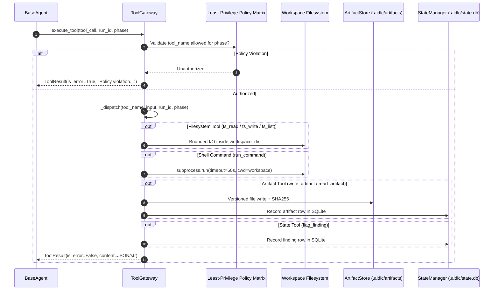

# AIDLC Tool Reference Guide

This document provides a comprehensive, technically rigorous reference for all mechanical tools implemented in the **AIDLC Tool Gateway** ([`src/aidlc/tools/gateway.py`](file:///home/chaitanya/Documents/project_euler/src/aidlc/tools/gateway.py)), including their schema definitions, internal execution mechanics, security constraints, and the phase-by-phase authorization matrix.

---

## 1. Architectural Foundation: The Tool Gateway Pattern

In AIDLC, agents do not directly execute arbitrary Python code, invoke subprocesses, or manipulate the filesystem directly. Instead, all external actions are intermediated by the **`ToolGateway`**.



### Key Principles

1. **Least Privilege by Phase**: Each lifecycle agent only receives tool declarations relevant to its duties. For example, security and verification review agents are strictly prevented from writing code to guarantee independent inspection without accidental self-mutation.
2. **Workspace Sandboxing**: Path inputs are resolved relative to `workspace_dir` to prevent path traversal attacks (`../`).
3. **Deterministic Feedback Protocol**: Every tool execution returns a standardized [`ToolResult`](file:///home/chaitanya/Documents/project_euler/src/aidlc/model_router.py#L26):
   - `tool_use_id: str` (matches LLM's requested tool call ID)
   - `content: str` (structured JSON string or file text)
   - `is_error: bool` (signals whether execution succeeded or errored)
   This result is appended to the message history with role `user` and block type `tool_result`, closing the reasoning loop for the next iteration.

---

## 2. Phase-by-Phase Authorization Matrix

The table below details the strict capability boundaries enforced by `ToolGateway.phase_policies`:

| Phase Agent | `fs_read_file` | `fs_write_file` | `fs_list_files` | `run_command` | `write_artifact` | `read_artifact` | `flag_finding` | `ask_user` / `read_human_input` | `complete_phase` |
| :--- | :---: | :---: | :---: | :---: | :---: | :---: | :---: | :---: | :---: |
| **`intake`** | ❌ | ❌ | ❌ | ❌ | ✅ | ✅ | ❌ | ✅ | ✅ |
| **`scaffold`** | ✅ | ✅ | ✅ | ❌ | ✅ | ✅ | ❌ | ❌ | ✅ |
| **`spec`** | ❌ | ❌ | ❌ | ❌ | ✅ | ✅ | ✅ | ✅ | ✅ |
| **`analyze-risks`** | ❌ | ❌ | ❌ | ❌ | ✅ | ✅ | ✅ | ❌ | ✅ |
| **`create-test-plan`**| ❌ | ❌ | ❌ | ❌ | ✅ | ✅ | ✅ | ❌ | ✅ |
| **`test-design`** | ✅ | ✅ | ✅ | ❌ | ✅ | ✅ | ✅ | ❌ | ✅ |
| **`build`** | ✅ | ✅ | ✅ | ✅ | ✅ | ✅ | ✅ | ❌ | ✅ |
| **`adversarial-review`**| ✅ | ❌ | ✅ | ❌ | ✅ | ✅ | ✅ | ❌ | ✅ |
| **`verify`** | ✅ | ❌ | ✅ | ✅ | ✅ | ✅ | ✅ | ❌ | ✅ |
| **`align`** | ✅ | ❌ | ❌ | ❌ | ✅ | ✅ | ✅ | ❌ | ✅ |
| **`release`** | ✅ | ✅ | ❌ | ❌ | ✅ | ✅ | ✅ | ❌ | ✅ |
| **`retro`** | ❌ | ❌ | ❌ | ❌ | ✅ | ✅ | ❌ | ❌ | ✅ |

### Security & Integrity Highlights:
- **Zero Command Execution in Scaffolding/Review**: Only **`build`** and **`verify`** have access to `run_command`. This eliminates the risk of code execution during analysis, risk review, or architecture specification.
- **Read-Only Review Phases**: `adversarial-review`, `verify`, and `align` are **strictly forbidden** from calling `fs_write_file`. They cannot modify the codebase to "force" a test to pass; they can only observe, execute tests (in verify), and flag findings.
- **Pure Analytical Phases**: `intake`, `spec`, `analyze-risks`, `create-test-plan`, and `retro` operate exclusively through artifacts and findings, with no workspace filesystem access.

---

## 3. Tool Specifications & Execution Details

### 3.1. Filesystem Tools

#### `fs_read_file`
Reads text files directly from the workspace.

- **Input Schema**:
  ```json
  {
    "type": "object",
    "properties": {
      "path": {
        "type": "string",
        "description": "Relative path to file inside workspace"
      }
    },
    "required": ["path"]
  }
  ```
- **Execution**:
  - Resolves `target = os.path.join(self.workspace_dir, inp["path"])`.
  - Reads UTF-8 contents.
  - Raises `FileNotFoundError` if the file does not exist.
- **Output**: Raw file string.

#### `fs_write_file`
Writes code or configuration to a file in the workspace.

- **Input Schema**:
  ```json
  {
    "type": "object",
    "properties": {
      "path": {
        "type": "string",
        "description": "Relative path to file inside workspace"
      },
      "content": {
        "type": "string",
        "description": "Full file content to write"
      }
    },
    "required": ["path", "content"]
  }
  ```
- **Execution**:
  - Resolves target path inside `self.workspace_dir`.
  - Automatically creates missing parent directories using `os.makedirs(os.path.dirname(target), exist_ok=True)`.
  - Writes UTF-8 content.
- **Output**: Confirmation string: `"Successfully wrote N bytes to <path>"`.

#### `fs_list_files`
Lists all files in the workspace or a specified subfolder.

- **Input Schema**:
  ```json
  {
    "type": "object",
    "properties": {
      "dir": {
        "type": "string",
        "description": "Subdirectory to list (relative to workspace)"
      },
      "recursive": {
        "type": "boolean",
        "description": "Whether to perform recursive directory traversal (default: true)"
      }
    }
  }
  ```
- **Execution**:
  - Uses `os.walk` starting from target directory.
  - Automatically filters out internal and cache directories: `.git`, `.aidlc`, `node_modules`, `__pycache__`, `.pytest_cache`.
- **Output**: Formatted JSON list of relative file paths, e.g.:
  ```json
  [
    "src/math/calc.py",
    "tests/test_calc.py",
    "pyproject.toml"
  ]
  ```

---

### 3.2. Execution Tools

#### `run_command`
Executes an arbitrary POSIX/Bash shell command in a subprocess.

- **Input Schema**:
  ```json
  {
    "type": "object",
    "properties": {
      "command": {
        "type": "string",
        "description": "Command line to execute"
      },
      "cwd": {
        "type": "string",
        "description": "Working directory relative to workspace root"
      }
    },
    "required": ["command"]
  }
  ```
- **Execution**:
  - Uses `subprocess.run(..., shell=True, capture_output=True, text=True, timeout=60)`.
  - Working directory bounded to `os.path.join(self.workspace_dir, cwd)`.
  - **Enforces a strict 60-second execution timeout**. If the process hangs, it catches `subprocess.TimeoutExpired` and safely returns exit code `124`.
- **Output**: JSON string containing exit code and standard streams:
  ```json
  {
    "exitCode": 0,
    "stdout": "================ 3 passed in 0.04s ================\n",
    "stderr": ""
  }
  ```

---

### 3.3. Lifecycle & Artifact Tools

#### `write_artifact`
Stores an immutable, versioned, cryptographic artifact for the active phase and registers it in SQLite.

- **Input Schema**:
  ```json
  {
    "type": "object",
    "properties": {
      "logical_name": {
        "type": "string",
        "description": "Artifact base name without extension (e.g. 'specification', 'test_plan')"
      },
      "type": {
        "type": "string",
        "description": "Artifact category/type"
      },
      "content": {
        "type": "string",
        "description": "Markdown or JSON artifact body"
      },
      "json_metadata": {
        "type": "object",
        "description": "Optional companion JSON metadata object"
      },
      "verdict": {
        "type": "string",
        "enum": ["pass", "fail", "warning", "info"]
      }
    },
    "required": ["logical_name", "content"]
  }
  ```
- **Execution**:
  1. **Sanitization**: Strips accidental `.md` or `.json` suffixes from `logical_name`.
  2. **Format Detection**: Detects whether `content` is JSON or Markdown.
  3. **Auto-Versioning**: Scans `.aidlc/artifacts/<run_id>/<phase>/` for existing versions (`<name>.v001.md`, `<name>.v002.md`) and increments the version counter.
  4. **Dual Writing**: Writes `<name>.v<version:03d>.<ext>` and an unversioned convenience pointer `<name>.<ext>`.
  5. **Companion Metadata**: If `json_metadata` is supplied, writes `<name>.v<version:03d>.json` alongside the markdown artifact.
  6. **Checksum Calculation**: Computes SHA-256 hash over the content bytes.
  7. **SQLite Indexing**: Calls `state_manager.add_artifact()`, updating both the `artifacts` table and the `state_json` artifact map.
- **Output**: JSON string confirming artifact registration:
  ```json
  {
    "success": true,
    "artifact_id": "art_c90069ba5432_1789214160899",
    "version": 1,
    "content_uri": ".aidlc/artifacts/run_1789214160899/spec/specification.v001.md",
    "checksum": "c90069ba5432d667c4d5b271d4b6eb03f3a8b273ce96f7c703b0cbe886b4cb46"
  }
  ```

#### `read_artifact`
Retrieves the text content of a previously written artifact.

- **Input Schema**:
  ```json
  {
    "type": "object",
    "properties": {
      "logical_name": {
        "type": "string",
        "description": "Logical artifact name (e.g. 'specification')"
      },
      "phase": {
        "type": "string",
        "description": "Phase that created the artifact (defaults to current phase)"
      },
      "path": {
        "type": "string",
        "description": "Direct file path or URI"
      }
    }
  }
  ```
- **Execution**:
  - If `logical_name` is provided: queries `ArtifactStore.get_latest_artifact_content(run_id, phase, logical_name)` which automatically selects the latest version (`.v002` over `.v001`).
  - If `path` is provided: loads the file directly via `ArtifactStore.read_artifact(path)`.
- **Output**: Raw string content of the artifact.

---

### 3.4. Engineering State & Quality Tools

#### `flag_finding`
Registers an engineering risk, specification ambiguity, contradiction, or test failure directly into SQLite state.

- **Input Schema**:
  ```json
  {
    "type": "object",
    "properties": {
      "id": {
        "type": "string",
        "description": "Optional unique finding ID (e.g. 'BLOCKER-001', 'DRIFT-002')"
      },
      "severity": {
        "type": "string",
        "enum": ["blocker", "critical", "major", "minor", "info"]
      },
      "category": {
        "type": "string",
        "description": "Category (e.g. 'contradiction', 'security', 'correctness', 'performance')"
      },
      "title": {
        "type": "string",
        "description": "Concise summary of the finding"
      },
      "description": {
        "type": "string",
        "description": "Detailed explanation, root cause analysis, or evidence"
      }
    },
    "required": ["title", "severity"]
  }
  ```
- **Execution**:
  - Generates an ID if not provided (`FIND-<hex4>`).
  - Sets `status = "open"`.
  - Persists the record into the `findings` table in `.aidlc/state.db`.
  - Updates the in-memory/JSON `findings.open` list in run state.
- **Output**:
  ```json
  {
    "success": true,
    "finding_id": "FIND-7a9b"
  }
  ```

#### `complete_phase`
Signals the agent has completed its phase obligations and is ready to conclude its execution loop.

- **Input Schema**:
  ```json
  {
    "type": "object",
    "properties": {
      "status": {
        "type": "string",
        "enum": ["passed", "failed", "blocked"],
        "description": "Phase termination status"
      },
      "verdict": {
        "type": "string",
        "enum": ["pass", "fail", "warning", "info"],
        "description": "Quality verdict"
      },
      "summary": {
        "type": "string",
        "description": "Executive summary of phase execution and results"
      }
    },
    "required": ["status"]
  }
  ```
- **Execution**:
  - Returns a structured completion payload.
  - When intercepted by [`BaseAgent.run`](file:///home/chaitanya/Documents/project_euler/src/aidlc/agents/base.py), it sets internal flag `is_completed = True`, records status and verdict, and breaks out of the reasoning loop immediately.

---

### 3.5. Human-in-the-Loop (HITL) Interaction Tools

#### `ask_user`
Prompts the human user with a structured decision question and optional choices.

- **Input Schema**:
  ```json
  {
    "type": "object",
    "properties": {
      "question": {
        "type": "string",
        "description": "Question to ask the developer"
      },
      "options": {
        "type": "array",
        "items": { "type": "string" },
        "description": "List of selectable choices"
      }
    },
    "required": ["question"]
  }
  ```
- **Execution**: Dispatches to `self.ask_user_fn` callback (interactive terminal prompt). If no interactive callback is configured (e.g., automated headless tests), returns the default fallback.

#### `read_human_input`
Prompts the human developer for free-form, unconstrained text input (e.g. pasting user stories, design documents, or domain rules).

- **Input Schema**:
  ```json
  {
    "type": "object",
    "properties": {
      "prompt": {
        "type": "string",
        "description": "Prompt instructions for human input"
      }
    },
    "required": ["prompt"]
  }
  ```
- **Execution**: Dispatches to `self.ask_user_fn` callback, prompting the developer for multi-line terminal input.

---

## 4. Error Handling and Recovery in Tool Dispatch

The gateway wraps all tool executions in a comprehensive `try/except` boundary:

```python
try:
    output = self._dispatch(tool_call.name, tool_call.input, run_id, phase)
    return ToolResult(tool_use_id=tool_call.id, content=output, is_error=False)
except Exception as e:
    return ToolResult(
        tool_use_id=tool_call.id,
        content=f"Error executing tool '{tool_call.name}': {str(e)}",
        is_error=True,
    )
```

### Self-Correction Flow
When a tool returns `is_error=True` (e.g., a non-existent file path in `fs_read_file` or a missing required parameter in `write_artifact`), the error message is fed directly back into the LLM context. Because `BaseAgent` runs up to 10 iterations per phase, the model reads the error message, diagnoses its mistaken argument, and makes a corrected tool call in the next iteration without crashing the pipeline.

